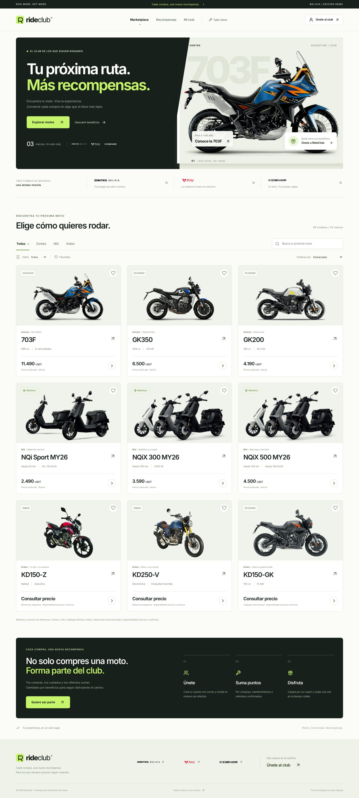

# RideClub

Marketplace y club de fidelización para **Zontes, NIU y Kiden**, creado para Hackathon By Paseo 2026.

**Cada compra, una nueva recompensa.** Descubre nueve motos reales, gana puntos por marca y canjéalos por cupones de beneficios de un solo uso.



[Registro con marca](docs/preview-registration.jpg) · [Vista móvil](docs/preview-mobile.jpg) · [Mi club](docs/preview-club.jpg) · [Recompensas](docs/preview-rewards.jpg) · [Compra](docs/preview-checkout.jpg) · [Beneficio](docs/preview-benefit.jpg) · [Club móvil](docs/preview-mobile-club.jpg) · [Verificación](docs/QA.md)

## Ejecutar

Node.js 22.12+ y npm.

```bash
git clone https://github.com/ManuelElias1999/RideClub.git
cd RideClub/frontend
npm ci
npm run dev
```

Abre la URL que muestra Vite, normalmente `http://localhost:5173`.

```bash
npm test
npm run build
npm run preview
```

Para entornos con interfaces de red restringidas:

```bash
npm run dev -- --host 127.0.0.1
```

## Esta entrega

- Marketplace de nueve modelos reales: **703F, GK350, GK200**; **NQi Sport MY26, NQiX 300 MY26, NQiX 500 MY26**; **KD150-Z, KD250-V, KD150-GK**.
- Fotografías y logos de las marcas, tipografía local, filtros por marca/estilo, búsqueda, orden por precio/nombre y favoritas.
- Fichas con características, fuente y precios publicados en USDT cuando existen. Compra simulada con saldo USDT ficticio para Zontes y NIU; Kiden requiere cotización. Las consultas comerciales llevan al sitio de origen; no se procesan pagos reales.
- Registro local por nombre, correo, **marca vinculada (Zontes / NIU / Kiden)**, **celular con región y prefijo (+591 por defecto)** y **número de referido opcional**; ingreso por correo para cuentas del mismo navegador.
- Cada cuenta recibe un **número único de ocho dígitos** y un enlace de invitación. El enlace precarga el código al registrarse.
- Perfil con wallet **pendiente de creación** y configuración preparada para Base Sepolia. No se genera una wallet ficticia ni se guardan claves.
- “Mi club”: saldo USDT de prueba, puntos separados por marca, compras con comprobante, beneficios disponibles/usados/vencidos, favoritas, referidos y actividad.
- Nueve **recompensas propuestas**: mantenimiento o diagnóstico eléctrico, descuento en repuestos/accesorios y limpieza/revisión visual.
- Canje local por tarjeta visual de beneficio con foto de mantenimiento, estado, vigencia y QR desplegable. El beneficio se valida una sola vez; se conserva en el historial sin descontar puntos nuevamente.
- Roles de demo **cliente / administrador**: el registro crea clientes; el acceso **Entrar como administrador demo** permite acreditar actividades, validar cupones y exportar CSV.
- **Administración global de RideClub**: métricas por empresa, clientes, compras, ventas USDT demo, motos vendidas, puntos canjeados, beneficios usados, wallets y exportación CSV por período.
- Alta y gestión de empresas con correo asignado, estado pendiente/publicado/suspendido, identidad visual y permisos. Solo las empresas publicadas aparecen en la landing y pueden recibir registros.
- **Dashboard independiente para cada empresa**: acceso con su correo (por ejemplo `zontes@gmail.com`), métricas y clientes limitados a su marca, gestión de motos, recompensas, precios, cupos, wallet y validación en taller.
- CRUD administrativo de clientes con registro manual, edición, bloqueo y baja lógica que conserva el historial.
- Reglas de puntos configurables por empresa para compras, referidos, mantenimientos y eventos, incluyendo vigencia y registro automático del vencimiento.
- Tendencias de registros, ventas y canjes durante los últimos 14 días.
- Contextos visuales diferenciados por empresa: color, logo, lema y banner propio en marketplace, recompensas y dashboard.
- Marca visible y editable en Mi club. Las cuentas anteriores conservan su marca; si no tenían una, pueden vincularla desde el perfil sin perder saldos ni compras.
- Prevención de duplicados de referencias por marca y de recompensas repetidas al mismo referido.
- Diseño responsive, diálogos nativos, navegación por teclado y reducción de movimiento.

## Recorrido de demo

1. Pulsa **Iniciar sesión** e ingresa con tu correo de demo en este navegador, o elige **Entrar a la demo de Manuel**.
2. En **Mi club**, tienes **20.000 USDT de prueba**. Las cuentas existentes reciben este saldo una vez al actualizar, conservando sus puntos, referidos y beneficios. También puedes usar **Recargar 20.000 USDT demo**.
3. En **Marketplace**, abre **Zontes 703F → Comprar con USDT de prueba → Confirmar compra de prueba**.
4. El saldo queda en **8.510 USDT**, recibes **1.000 puntos Zontes** adicionales y se guarda un comprobante en **Mi club → Mis compras**. Recargar la página conserva los cambios.
5. En **Recompensas**, abre **Mantenimiento básico** Zontes y canjea 500 puntos. Aparece la tarjeta con foto; **Mostrar QR para el taller** despliega el identificador.
6. Pulsa **Probar validación en taller → Entrar como administrador demo** y confirma la autorización del cliente y el uso. El beneficio pasa a **Utilizados y vencidos**, marcado **Consumido · quema simulada**.
7. Para volver al cliente, entra en **Mi club → Salir de la demo → Iniciar sesión** con su correo. Un segundo uso se rechaza. Se conserva el historial sin volver a descontar puntos.

Una compra de prueba es una transición local, sin pagos ni reserva comercial. El comprobante tiene una clave de operación para evitar cobrar o acreditar puntos dos veces al repetir una confirmación.

### Probar referidos

1. Copia el código de Manuel (**10002026**) o su enlace desde Mi club.
2. Sal de la demo y crea otra cuenta con un correo de prueba y ese código. La nueva cuenta empieza con cero puntos.
3. Compra una moto con precio en el marketplace usando el saldo de prueba.
4. La primera compra acredita **200 puntos de esa marca al invitador**, una sola vez por invitado. También puedes probar la confirmación manual en el taller; comparte la misma protección contra duplicados.
5. Ingresa a la demo de Manuel para consultar sus referidos y el saldo actualizado.

La opción **Sobre la demo y sus fuentes → Reiniciar datos de esta demo** restablece los datos locales.

### Probar administración y empresas

1. Pulsa **Iniciar sesión → Entrar como administrador demo** para abrir la administración global.
2. En **Empresas**, registra una empresa y selecciona **Publicada** para que aparezca en la landing y en el registro de clientes; **Suspendida** retira su catálogo y bloquea la edición de la empresa.
3. Consulta métricas globales o filtra una empresa. Las secciones muestran clientes, compras, motos, canjes, wallets y actividad; los reportes se pueden exportar en CSV.
4. Cierra sesión e ingresa con `zontes@gmail.com`, `niu@gmail.com` o `kiden@gmail.com`. Cada correo abre únicamente el dashboard y los datos de esa empresa.
5. Desde el dashboard empresarial se pueden agregar, editar o retirar motos y recompensas, configurar precios, cupos y una dirección EVM de demo. Los cambios publicados se reflejan en la landing.

Los roles y datos siguen siendo locales en esta etapa. No existe contraseña ni sincronización real entre navegadores hasta implementar el backend.

## Estado de backend y blockchain

**Esta etapa es frontend.** No incluye backend, verificación de correo, autenticación segura, contratos, pagos, wallets, tokens ni NFTs reales. El saldo USDT ficticio, las compras, los puntos y cupones se guardan en `localStorage` del navegador actual; no se comparten entre dispositivos.

El taller requiere una cuenta con rol administrador dentro de la demo. Ese acceso es público y sirve para probar el frontend; la autorización real se hará en el servidor. Su casilla de autorización no sustituye una verificación de titularidad; el QR solo identifica el cupón local.

La siguiente etapa integrará **EVM en Base Sepolia (chain ID 84532)**: registro por correo con creación automática de wallet, puntos tokenizados y cupones ERC-721 que se consumen y queman con autorización del cliente y del taller. Se prevé descontar puntos y emitir el NFT en una sola transacción. Los cupones usados conservarán su historial.

## Clientes existentes y roles

La autenticación real y la sincronización con la base de clientes existente se integrarán en el backend. La elección de marca en la demo guarda la asociación del perfil, pero no verifica que exista un registro comercial en esa empresa. Los administradores se asignarán desde el servidor; el cliente no podrá elegir ese rol al registrarse.

[Plan de integración con clientes existentes](docs/CUSTOMER_INTEGRATION.md): identidad verificada, asociación por marca, identificación del cliente externo, permisos y sincronización sin duplicar movimientos.

## Datos de las marcas

Zontes y NIU usan catálogos locales de Bolivia. Kiden usa referencias de MotoFun Argentina y del catálogo oficial internacional; **su disponibilidad en Bolivia no está confirmada**. Los beneficios, descuentos, reglas, cupos y vigencias son propuestas para la hackathon, pendientes de aprobación comercial.

Consulta de fuentes: 3 de octubre de 2026. Ver [modelos, fuentes y recursos visuales](docs/SOURCES.md) y [arquitectura e integración futura](docs/ARCHITECTURE.md).

## Estructura

```text
frontend/
  public/assets/       Fotos, logos y tipografía locales
  src/components/      Marketplace, registro, club, taller y dashboards
  src/data/catalog.ts  Modelos, fuentes, beneficios y reglas propuestas
  src/lib/demo.ts      Cuentas, compras, USDT demo, referidos y cupones
  src/lib/business.ts  Permisos, métricas y gestión de empresas/catálogos
  src/lib/phone.ts     Regiones, prefijos y validación del celular
  src/lib/demo.test.ts Pruebas del flujo de demo
  src/App.tsx          Navegación, composición y persistencia
  src/styles.css       Diseño responsive
docs/                  Arquitectura, fuentes, capturas y verificación
```
